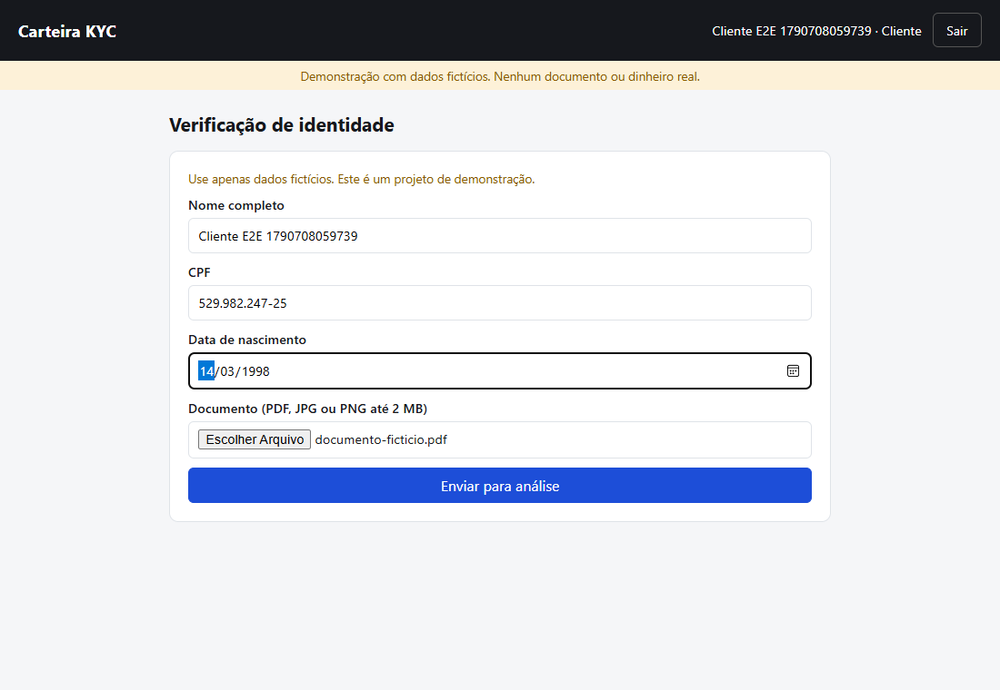
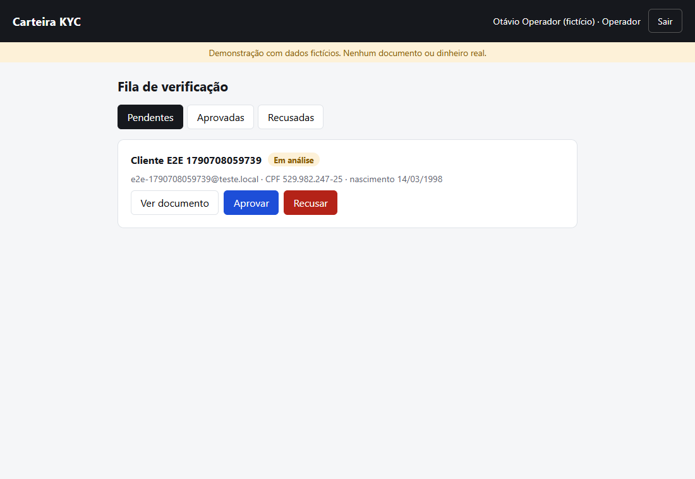
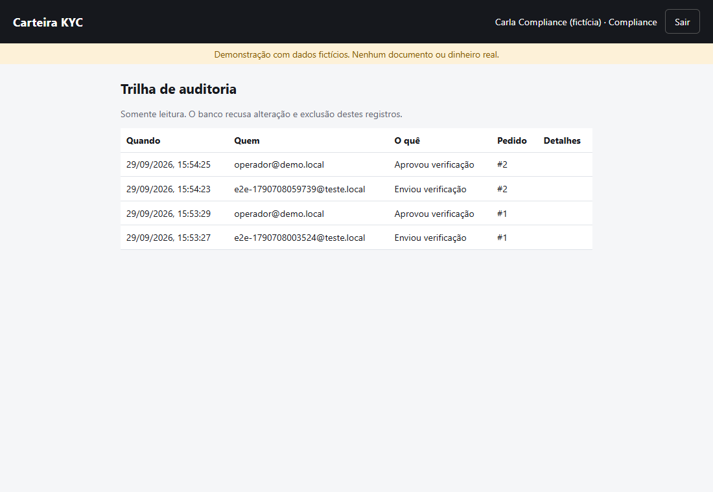

# Carteira KYC

**Em construção. Esta é a primeira fatia:** cadastro, verificação de identidade (KYC) e trilha de auditoria.
Depósito, saque e extrato ainda não existem, e o projeto ainda não está publicado em nuvem.
Domínio de fintech **fictício**: nenhum documento, CPF ou dinheiro real.

English version below.

| Cliente envia os dados | Operador decide | Compliance audita |
|---|---|---|
|  |  |  |

## O que funciona

- **Cliente**: cria conta, faz login (JWT), envia nome, CPF, data de nascimento e um documento (PDF, JPG ou PNG até 2 MB) e acompanha o status.
- **Operador**: vê a fila de pedidos, abre o documento e aprova, ou recusa com motivo obrigatório.
- **Compliance**: vê a trilha de auditoria (quem fez o quê e quando), só leitura.
- Cada papel só enxerga o que pode. Um cliente que tenta abrir o pedido de outro recebe 404, não 403, para não confirmar que o pedido existe.

## Stack

| Parte | Ferramentas |
|---|---|
| Backend | Python, Django 6.1, Django REST Framework, Simple JWT, PostgreSQL 17 |
| Frontend | React 19, TypeScript, Vite |
| Testes | pytest-django (23), Vitest + React Testing Library (10), Playwright ponta a ponta (1) |
| CI | GitHub Actions: backend com Postgres, frontend (lint, testes, build) e Playwright |

## Decisões

1. **Regras no banco, não só no código.** Um índice único parcial do Postgres impede dois pedidos ativos por cliente, mesmo com duas requisições simultâneas. Uma constraint impede recusa sem motivo.
2. **Auditoria somente inserção.** Um trigger do Postgres, numa migração escrita à mão, recusa UPDATE e DELETE na tabela de auditoria. A decisão e o evento de auditoria são gravados na mesma transação.
3. **Corrida entre operadores.** A decisão usa `select_for_update`. O teste dispara duas threads decidindo o mesmo pedido; só uma passa. Para confirmar que o teste pega o problema, a trava foi removida e o teste falhou nas 3 execuções.
4. **Upload conferido pelos bytes.** O tipo informado pelo navegador pode ser falsificado; o backend confere a assinatura do arquivo (`%PDF`, JPEG, PNG). Um executável renomeado para .pdf é recusado.
5. **Cadastro público sempre cria cliente.** Um campo `papel` no corpo da requisição é ignorado, e há teste para isso.
6. **CPF validado nos dois lados** pelos dígitos verificadores: no navegador para dar resposta imediata, no backend porque a API pode ser chamada sem o formulário.

## Como rodar

Requisitos: Python 3.13+, Node 24, Docker.

```bash
python scripts/gerar_env.py               # .env com segredos aleatórios
docker compose up -d --wait               # Postgres em 127.0.0.1:5434
cd backend
python -m venv .venv && .venv/Scripts/activate   # Linux/macOS: source .venv/bin/activate
pip install -r requirements-dev.txt
python manage.py migrate
python manage.py popular_demo             # cliente, operador e compliance de demonstração (senha: DEMO_SENHA do .env)
python manage.py runserver                # API em http://127.0.0.1:8000
pytest

cd ../frontend
npm ci
npm run dev                               # http://127.0.0.1:5173
npm test
npx playwright test                       # ponta a ponta; sobe backend e frontend sozinho
```

## Limitações e próximos passos

- **Não publicado em nuvem ainda.** Plano: frontend no S3 + CloudFront, API no AWS Lambda, banco no Neon (Postgres). Nada disso foi testado ainda.
- **Documentos em disco local.** Na nuvem vão para o S3 com URL assinada.
- **Tokens JWT no sessionStorage.** Somem ao fechar a aba, mas qualquer script da página consegue lê-los. Cookie HttpOnly é o próximo passo.
- **Falta a carteira:** depósito com chave de idempotência, saque, extrato em livro-razão (débito e crédito, sem campo de saldo editável), consulta otimizada com `EXPLAIN ANALYZE` documentado.
- Feito com Claude Code no ciclo especificação, execução e revisão. Correções da revisão até aqui: testes de 89 s para 1,6 s (hash de senha rápido só nos testes); aviso do lint sobre `setState` dentro de efeito corrigido; `react-router` removido por não ser necessário com uma tela por papel.

---

# Carteira KYC (English)

**Work in progress. This is the first slice:** sign-up, identity verification (KYC) and an audit trail.
Deposits, withdrawals and statements do not exist yet, and the project is not deployed to the cloud yet.
**Fictional** fintech domain: no real documents, IDs or money.

## What works

- **Customer**: signs up, logs in (JWT), submits name, CPF (Brazilian taxpayer ID), birth date and a document (PDF, JPG or PNG up to 2 MB), and follows the status.
- **Operator**: sees the queue, opens the document and approves, or rejects with a required reason.
- **Compliance**: reads the audit trail (who did what and when).
- Each role sees only what it may. A customer requesting another customer's submission gets 404, not 403, so the ID's existence is not confirmed.

## Stack

Python, Django 6.1, Django REST Framework, Simple JWT, PostgreSQL 17 on the backend; React 19, TypeScript and Vite on the frontend. Tests: pytest-django (23), Vitest + React Testing Library (10), one Playwright end-to-end test. GitHub Actions runs all three.

## Decisions

1. **Rules enforced by the database.** A partial unique index allows only one active submission per customer, even under concurrent requests; a check constraint requires a rejection reason.
2. **Insert-only audit log.** A Postgres trigger, added in a hand-written migration, rejects UPDATE and DELETE on the audit table. Each decision and its audit event are written in the same transaction.
3. **Operator race condition.** Decisions use `select_for_update`. A test runs two threads deciding the same submission; only one succeeds. With the lock removed, the test failed in 3 of 3 runs.
4. **Uploads checked by file signature**, not by the browser-provided content type.
5. **Public sign-up always creates a customer**; a `role` field in the request body is ignored (tested).
6. **CPF check digits validated on both sides.**

## Limitations and next steps

Not deployed yet (planned: S3 + CloudFront, AWS Lambda, Neon Postgres; untested). Documents are stored on local disk (S3 with signed URLs next). JWTs live in sessionStorage (HttpOnly cookie next). The wallet part (idempotent deposits, withdrawals, double-entry ledger statement, a query tuned with `EXPLAIN ANALYZE`) is still to be built. Built with Claude Code in a spec, build and review loop.
