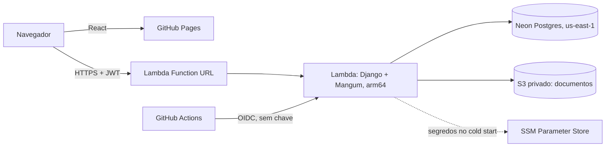

# Carteira KYC

**Em construção. Esta é a primeira fatia:** cadastro, verificação de identidade (KYC) e trilha de auditoria.
Depósito, saque e extrato ainda não existem.
Domínio de fintech **fictício**: nenhum documento, CPF ou dinheiro real.

**Demo:** [hugo-guigo.github.io/carteira-kyc](https://hugo-guigo.github.io/carteira-kyc/) (frontend no GitHub Pages, API na AWS).
Qualquer pessoa pode criar uma conta de cliente e enviar dados fictícios. As contas de operador e de
compliance não são públicas, porque dariam acesso aos documentos enviados por outros visitantes; o fluxo
delas aparece nas imagens abaixo e no teste de ponta a ponta.

English version below.

| Cliente envia os dados | Operador decide | Compliance audita |
|---|---|---|
|  |  |  |

## O que funciona

- **Cliente**: cria conta, faz login (JWT), envia nome, CPF, data de nascimento e um documento (PDF, JPG ou PNG até 2 MB) e acompanha o status.
- **Operador**: vê a fila de pedidos, abre o documento e aprova, ou recusa com motivo obrigatório.
- **Compliance**: vê a trilha de auditoria (quem fez o quê e quando), só leitura.
- Cada papel só enxerga o que pode. Um cliente que tenta abrir o pedido de outro recebe 404, não 403, para não confirmar que o pedido existe.

## Stack

| Parte | Ferramentas |
|---|---|
| Backend | Python, Django 6.1, Django REST Framework, Simple JWT, PostgreSQL 17 |
| Frontend | React 19, TypeScript, Vite |
| Testes | pytest-django (23), Vitest + React Testing Library (10), Playwright ponta a ponta (1) |
| CI/CD | GitHub Actions: backend com Postgres, frontend (lint, testes, build) e Playwright; depois, deploy da API na AWS (OIDC) e do site no GitHub Pages |
| Nuvem | AWS Lambda, S3, SSM Parameter Store, CloudFormation, AWS Budgets; Neon (Postgres) |

## Decisões

1. **Regras no banco, não só no código.** Um índice único parcial do Postgres impede dois pedidos ativos por cliente, mesmo com duas requisições simultâneas. Uma constraint impede recusa sem motivo.
2. **Auditoria somente inserção.** Um trigger do Postgres, numa migração escrita à mão, recusa UPDATE e DELETE na tabela de auditoria. A decisão e o evento de auditoria são gravados na mesma transação.
3. **Corrida entre operadores.** A decisão usa `select_for_update`. O teste dispara duas threads decidindo o mesmo pedido; só uma passa. Para confirmar que o teste pega o problema, a trava foi removida e o teste falhou nas 3 execuções.
4. **Upload conferido pelos bytes.** O tipo informado pelo navegador pode ser falsificado; o backend confere a assinatura do arquivo (`%PDF`, JPEG, PNG). Um executável renomeado para .pdf é recusado.
5. **Cadastro público sempre cria cliente.** Um campo `papel` no corpo da requisição é ignorado, e há teste para isso.
6. **CPF validado nos dois lados** pelos dígitos verificadores: no navegador para dar resposta imediata, no backend porque a API pode ser chamada sem o formulário.

## Como rodar

Requisitos: Python 3.13+, Node 24, Docker.

```bash
python scripts/gerar_env.py               # .env com segredos aleatórios
docker compose up -d --wait               # Postgres em 127.0.0.1:5434
cd backend
python -m venv .venv && .venv/Scripts/activate   # Linux/macOS: source .venv/bin/activate
pip install -r requirements-dev.txt
python manage.py migrate
python manage.py popular_demo             # cliente, operador e compliance de demonstração (senha: DEMO_SENHA do .env)
python manage.py runserver                # API em http://127.0.0.1:8000
pytest

cd ../frontend
npm ci
npm run dev                               # http://127.0.0.1:5173
npm test
npx playwright test                       # ponta a ponta; sobe backend e frontend sozinho
```

## Na nuvem (AWS)



- **Infraestrutura como código** em CloudFormation ([infra/](infra/)): Lambda, Function URL, bucket de documentos, papéis IAM e o papel de deploy. Validada com `cfn-lint` antes de cada criação.
- **Alerta de orçamento antes de tudo** ([infra/orcamento.yaml](infra/orcamento.yaml)): US$ 1 por mês, sem descontar créditos (senão o plano Free esconderia o consumo).
- **Nenhuma chave de longa duração.** Local: `aws login` (credenciais temporárias). CI: o GitHub Actions troca um token OIDC por credenciais de 1 hora de um papel que só atualiza o código da função e só aceita a branch main deste repositório.
- **Segredos no SSM Parameter Store** (SecureString). O Lambda lê no cold start; nada no template, nas variáveis de ambiente visíveis nem no repositório.
- **Migrações rodam dentro do Lambda** por invocação direta (`{"comando": "migrate"}`), que exige permissão IAM. O CI nunca vê a senha do banco, e a URL pública não aceita esse formato.
- **Menor privilégio no S3.** O Lambda só lê e grava em `kyc/*`, sem listar nem apagar. Isso quebrou o primeiro upload: o `django-storages` checava se o arquivo existia, e sem `s3:ListBucket` o S3 responde 403 em vez de 404. A correção foi desligar a checagem (os nomes já são UUID), e não ampliar a permissão.
- **Documentos expiram em 30 dias** (regra de ciclo de vida do bucket), porque a demo é pública.
- **Neon pelo pooler** (PgBouncer em modo transação): comandos preparados e cursores do lado do servidor desligados no Django.
- **Teste de fumaça contra a nuvem** ([scripts/fumaca.py](scripts/fumaca.py)): cadastro, upload no S3, download pelo operador, aprovação, conflito 409, auditoria e bloqueio do cliente. Passou nos 9 itens em 29/09/2026, com respostas entre 0,56 e 1,8 s (as mais lentas são login e cadastro, pelo hash de senha).
- **Custo:** Lambda fica na cota grátis permanente (1 milhão de requisições por mês); S3 e logs são centavos cobertos pelos créditos do plano Free; Neon no plano grátis.

## Limitações e próximos passos

- **Sem CloudFront.** A conta nova foi bloqueada para CloudFront até verificação pelo Suporte da AWS ("account must be verified"). O template já tem a distribuição (S3 privado + `/api/*` no Lambda, mesma origem, sem CORS) atrás do parâmetro `UsarCloudFront`; hoje o frontend fica no GitHub Pages e a API libera CORS só para essa origem.
- **Function URL pública sem WAF.** O limite de requisições do DRF (30/min anônimo, 60/min logado) fica na memória de cada instância do Lambda, então é aproximado. Com CloudFront, dá para pôr limite na borda.
- **Tokens JWT no sessionStorage.** Somem ao fechar a aba, mas qualquer script da página consegue lê-los. Cookie HttpOnly é o próximo passo.
- **Falta a carteira:** depósito com chave de idempotência, saque, extrato em livro-razão (débito e crédito, sem campo de saldo editável), consulta otimizada com `EXPLAIN ANALYZE` documentado.
- Feito com Claude Code no ciclo especificação, execução e revisão. Correções da revisão até aqui: testes de 89 s para 1,6 s (hash de senha rápido só nos testes); aviso do lint sobre `setState` dentro de efeito corrigido; `react-router` removido por não ser necessário com uma tela por papel.

---

# Carteira KYC (English)

**Work in progress. This is the first slice:** sign-up, identity verification (KYC) and an audit trail.
Deposits, withdrawals and statements do not exist yet.
**Fictional** fintech domain: no real documents, IDs or money.

## What works

- **Customer**: signs up, logs in (JWT), submits name, CPF (Brazilian taxpayer ID), birth date and a document (PDF, JPG or PNG up to 2 MB), and follows the status.
- **Operator**: sees the queue, opens the document and approves, or rejects with a required reason.
- **Compliance**: reads the audit trail (who did what and when).
- Each role sees only what it may. A customer requesting another customer's submission gets 404, not 403, so the ID's existence is not confirmed.

## Stack

Python, Django 6.1, Django REST Framework, Simple JWT, PostgreSQL 17 on the backend; React 19, TypeScript and Vite on the frontend. Tests: pytest-django (23), Vitest + React Testing Library (10), one Playwright end-to-end test. GitHub Actions runs all three.

## Decisions

1. **Rules enforced by the database.** A partial unique index allows only one active submission per customer, even under concurrent requests; a check constraint requires a rejection reason.
2. **Insert-only audit log.** A Postgres trigger, added in a hand-written migration, rejects UPDATE and DELETE on the audit table. Each decision and its audit event are written in the same transaction.
3. **Operator race condition.** Decisions use `select_for_update`. A test runs two threads deciding the same submission; only one succeeds. With the lock removed, the test failed in 3 of 3 runs.
4. **Uploads checked by file signature**, not by the browser-provided content type.
5. **Public sign-up always creates a customer**; a `role` field in the request body is ignored (tested).
6. **CPF check digits validated on both sides.**

## On AWS

Live demo: [hugo-guigo.github.io/carteira-kyc](https://hugo-guigo.github.io/carteira-kyc/). Anyone can sign up as a customer; operator and compliance accounts are not public because they expose other visitors' uploads.

Frontend on GitHub Pages; Django API on AWS Lambda (arm64, Mangum) behind a Function URL; Neon Postgres; private S3 bucket for documents (30-day expiry); secrets in SSM Parameter Store, loaded at cold start. Infrastructure is CloudFormation (validated with cfn-lint), created after a US$ 1 monthly budget alert that ignores credits. No long-lived keys: `aws login` locally, GitHub Actions via OIDC with a role that only deploys code from main. Migrations run inside Lambda through an IAM-only direct invocation, so CI never sees the database password. A least-privilege S3 policy (no ListBucket) broke the first upload because S3 returns 403 instead of 404 for missing keys; the fix was to drop the existence check (keys are UUIDs), not to widen the policy. A smoke test against the cloud passed 9 of 9 checks on 2026-09-29.

## Limitations and next steps

CloudFront is templated but off: the new account was blocked from CloudFront pending AWS Support verification. The public Function URL has no WAF; DRF throttling is per Lambda instance. JWTs live in sessionStorage (HttpOnly cookie next). The wallet part (idempotent deposits, withdrawals, double-entry ledger statement, a query tuned with `EXPLAIN ANALYZE`) is still to be built. Built with Claude Code in a spec, build and review loop.
